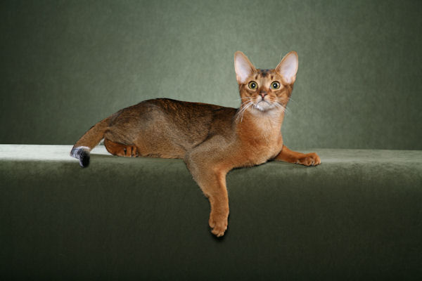

# CLI Demos for C++ Vision Task APIs

This folder contains simple command-line tools for easily trying out the C++
Vision Task APIs.

## Coral Integration

Task Library now supports fast TFLite inference delegated onto
[Coral Edge TPU devices][4] on Linux and macOS. See the
[documentation](https://www.tensorflow.org/lite/inference_with_metadata/task_library/overview#run_task_library_with_delegates)
for more details.

To run the demo on a Coral device, add `--define darwinn_portable=1` to the
bazel command.

Note the `libusb` package is required. It can be installed as follows:

```bash
# On Linux
sudo apt-get install libusb-1.0-0-dev

# On macOS using MacPorts
port install libusb
# or Homebrew
brew install libusb
```

See the example commands in each task demo below.

You can also explore more [pretrained Coral model](https://coral.ai/models) and
try them in the demo. All the models have populated with
[TFLite Model Metadata](https://www.tensorflow.org/lite/convert/metadata).

## Image Classifier

#### Prerequisites

You will need:

*   a TFLite image classification model (e.g.
    [aiy/vision/classifier/birds_V1][1], a bird classification model available
    on TensorFlow Hub),
*   a PNG, JPEG or GIF image to run classification on, e.g.:


#### Usage

In the console, run:

```bash
# Download the model:
curl \
 -L 'https://tfhub.dev/google/lite-model/aiy/vision/classifier/birds_V1/3?lite-format=tflite' \
 -o /tmp/aiy_vision_classifier_birds_V1_3.tflite

# Run the classification tool:
bazel run -c opt \
 tensorflow_lite_support/examples/task/vision/desktop:image_classifier_demo -- \
 --model_path=/tmp/aiy_vision_classifier_birds_V1_3.tflite \
 --image_path=\
$(pwd)/tensorflow_lite_support/examples/task/vision/desktop/g3doc/sparrow.jpg \
 --max_results=3
```

To run the demo on a [Coral Edge TPU device][4], check
[Coral Integration](#coral-integration) section and then run:

```bash
# Download the Coral model:
curl \
 -L 'https://github.com/google-coral/test_data/raw/master/mobilenet_v2_1.0_224_inat_bird_quant_edgetpu.tflite' \
 -o /tmp/mobilenet_v2_1.0_224_inat_bird_quant_edgetpu.tflite

# Run the classification tool:
bazel run -c opt --define darwinn_portable=1 \
 tensorflow_lite_support/examples/task/vision/desktop:image_classifier_demo -- \
 --model_path=/tmp/mobilenet_v2_1.0_224_inat_bird_quant_edgetpu.tflite \
 --image_path=\
$(pwd)/tensorflow_lite_support/examples/task/vision/desktop/g3doc/sparrow.jpg \
 --max_results=3 \
 --use_coral=true
```

#### Results

In the console, you should get:

```
Time cost to classify the input image on CPU: 109ms
Results:
  Rank #0:
   index       : 671
   score       : 0.91406
   class name  : /m/01bwb9
   display name: Passer domesticus
  Rank #1:
   index       : 670
   score       : 0.00391
   class name  : /m/01bwbt
   display name: Passer montanus
  Rank #2:
   index       : 495
   score       : 0.00391
   class name  : /m/0bwm6m
   display name: Passer italiae
```

## Object Detector

#### Prerequisites

You will need:

*   a TFLite object detection model (e.g. [ssd_mobilenet_v1][2], a generic
    object detection model available on TensorFlow Hub),
*   a PNG, JPEG or GIF image to run detection on, e.g.:


#### Usage

In the console, run:

```bash
# Download the model:
curl \
 -L 'https://tfhub.dev/tensorflow/lite-model/ssd_mobilenet_v1/1/metadata/1?lite-format=tflite' \
 -o /tmp/ssd_mobilenet_v1_1_metadata_1.tflite

# Run the detection tool:
bazel run -c opt \
 tensorflow_lite_support/examples/task/vision/desktop:object_detector_demo -- \
 --model_path=/tmp/ssd_mobilenet_v1_1_metadata_1.tflite \
 --image_path=\
$(pwd)/tensorflow_lite_support/examples/task/vision/desktop/g3doc/dogs.jpg \
 --output_png=/tmp/detection-output.png \
 --max_results=2
```

To run the demo on a [Coral Edge TPU device][4], check
[Coral Integration](#coral-integration) section and then run:

```bash
# Download the model:
curl \
 -L 'https://github.com/google-coral/test_data/raw/master/ssd_mobilenet_v1_coco_quant_postprocess_edgetpu.tflite' \
 -o /tmp/ssd_mobilenet_v1_coco_quant_postprocess_edgetpu.tflite

# Run the detection tool:
bazel run -c opt --define darwinn_portable=1 \
 tensorflow_lite_support/examples/task/vision/desktop:object_detector_demo -- \
 --model_path=/tmp/ssd_mobilenet_v1_coco_quant_postprocess_edgetpu.tflite \
 --image_path=\
$(pwd)/tensorflow_lite_support/examples/task/vision/desktop/g3doc/dogs.jpg \
 --output_png=/tmp/detection-output.png \
 --max_results=2 \
 --use_coral=true
```

#### Results

In the console, you should get:

```
Time cost to detect the input image on CPU: 123 ms
Results saved to: /tmp/detection-output.png
Results:
 Detection #0 (red):
  Box: (x: 355, y: 133, w: 190, h: 206)
  Top-1 class:
   index       : 17
   score       : 0.73828
   class name  : dog
 Detection #1 (green):
  Box: (x: 103, y: 15, w: 138, h: 369)
  Top-1 class:
   index       : 17
   score       : 0.73047
   class name  : dog
```

And `/tmp/detection-output.jpg` should contain:


## Image Segmenter

#### Prerequisites

You will need:

*   a TFLite image segmentation model (e.g. [deeplab_v3][3], a generic
    segmentation model available on TensorFlow Hub),
*   a PNG, JPEG or GIF image to run segmentation on, e.g.:



#### Usage

In the console, run:

```bash
# Download the model:
curl \
 -L 'https://github.com/google-coral/test_data/raw/master/keras_post_training_unet_mv2_128_quant.tflite' \
 -o /tmp/keras_post_training_unet_mv2_128_quant.tflite

# Run the segmentation tool:
bazel run -c opt \
 tensorflow_lite_support/examples/task/vision/desktop:image_segmenter_demo -- \
 --model_path=/tmp/keras_post_training_unet_mv2_128_quant.tflite \
 --image_path=\
$(pwd)/tensorflow_lite_support/examples/task/vision/desktop/g3doc/cat.jpg \
 --output_mask_png=/tmp/segmentation-output.png
```

To run the demo on a [Coral Edge TPU device][4], check
[Coral Integration](#coral-integration) section and then run:

```bash
# Download the model:
curl \
 -L 'https://github.com/google-coral/test_data/raw/master/keras_post_training_unet_mv2_128_quant_edgetpu.tflite' \
 -o /tmp/keras_post_training_unet_mv2_128_quant_edgetpu.tflite

# Run the segmentation tool:
bazel run -c opt --define darwinn_portable=1 \
 tensorflow_lite_support/examples/task/vision/desktop:image_segmenter_demo -- \
 --model_path=/tmp/keras_post_training_unet_mv2_128_quant_edgetpu.tflite \
 --image_path=\
$(pwd)/tensorflow_lite_support/examples/task/vision/desktop/g3doc/cat.jpg \
 --output_mask_png=/tmp/segmentation-output.png \
 --use_coral=true
```

#### Results

In the console, you should get:

```
Time cost to segment the input image on CPU: 89.9316 ms
Category mask saved to: /tmp/segmentation-output.png
Color Legend:
 (r: 000, g: 000, b: 000):
  index       : 0
  class name  : pet
 (r: 128, g: 000, b: 000):
  index       : 1
  class name  : background
 (r: 000, g: 128, b: 000):
  index       : 2
  class name  : border
Tip: use a color picker on the output PNG file to inspect the output mask with
this legend.
```

And `/tmp/segmentation-output.jpg` should contain the segmentation mask:


## ImageEmbedder

#### Prerequisites

You will need:

*   a TFLite image embedder model (e.g. [mobilenet v3][5], a generic image
    embedder trained on ImageNet),
*   two PNG, JPEG or GIF image to extract embeddings from.

#### Usage

The ImageEmbedder demo tool takes two images as inputs, and outputs the
[cosine similarity][6] between their embeddings.

In the console, run:

```bash
# Download the model:
curl \
 -L 'https://tfhub.dev/google/lite-model/imagenet/mobilenet_v3_small_100_224/feature_vector/5/metadata/1?lite-format=tflite' \
 -o /tmp/mobilenet_v3_embedder.tflite

# Run the embedder tool:
bazel run -c opt \
tensorflow_lite_support/examples/task/vision/desktop:image_embedder_demo -- \
--model_path=/tmp/mobilenet_v3_embedder.tflite \
--l2_normalize \
--first_image_path=$(pwd)/tensorflow_lite_support/cc/test/testdata/task/vision/burger.jpg \
--second_image_path=$(pwd)/tensorflow_lite_support/cc/test/testdata/task/vision/burger_crop.jpg
```

#### Results

In the console, you should get:

```
Cosine similarity: 0.932738
```

## ImageSearcher

#### Prerequisites

You will need:

*   a TFLite image embedder model (e.g. [mobilenet v3][5], a generic image
    embedder trained on ImageNet),
*   an index built from that embedder model using [Model Maker][7].

Model Maker also provides the ability to add the index directly to the embedder
model metadata. The demo also supports this : just omit the `--index_path`
argument.

#### Usage

In this example, we'll be using a test index built from the mobilenet v3
embedder model, which only contains 5 embeddings extracted from images of a
burger, a cat, a dog, a bird and a car.

In the console, run:

```bash
# Download the model:
curl \
 -L 'https://tfhub.dev/google/lite-model/imagenet/mobilenet_v3_small_100_224/feature_vector/5/metadata/1?lite-format=tflite' \
 -o /tmp/mobilenet_v3_embedder.tflite

# Run the searcher tool:
bazel run -c opt \
tensorflow_lite_support/examples/task/vision/desktop:image_searcher_demo -- \
--model_path=/tmp/mobilenet_v3_embedder.tflite \
--l2_normalize \
--index_path=$(pwd)/third_party/tensorflow_lite_support/cc/test/testdata/task/vision/searcher_index.ldb \
--image_path=$(pwd)/third_party/tensorflow_lite_support/cc/test/testdata/task/vision/burger_crop.jpg
```

#### Results

In the console, you should get:

```
Results:
 Rank#0:
  metadata: burger
  distance: 0.13452
 Rank#1:
  metadata: car
  distance: 1.81935
 Rank#2:
  metadata: bird
  distance: 1.96617
 Rank#3:
  metadata: dog
  distance: 2.05610
 Rank#4:
  metadata: cat
  distance: 2.06347
```

[1]: https://tfhub.dev/google/lite-model/aiy/vision/classifier/birds_V1/3
[2]: https://tfhub.dev/tensorflow/lite-model/ssd_mobilenet_v1/1/metadata/2
[3]: https://tfhub.dev/tensorflow/lite-model/deeplabv3/1/metadata/2
[4]: https://coral.ai/docs/edgetpu/inference/
[5]: https://tfhub.dev/google/lite-model/imagenet/mobilenet_v3_small_100_224/feature_vector/5/metadata/1
[6]: https://en.wikipedia.org/wiki/Cosine_similarity
[7]: https://www.tensorflow.org/lite/api_docs/python/tflite_model_maker/searcher
